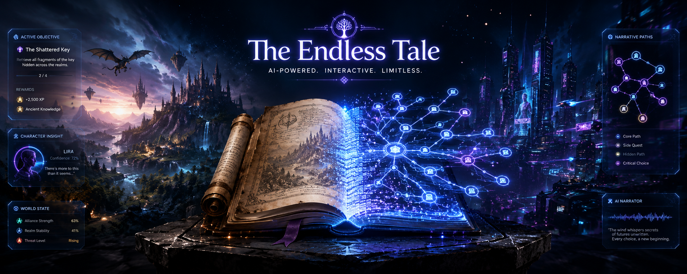
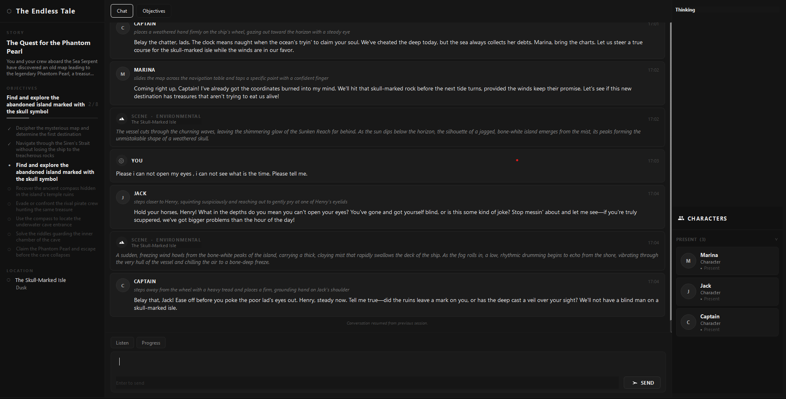

# The Endless Tale - An Interactive Story Adventure




[](LICENSE)
[](https://github.com/Jit-Roy/The-Endless-Tale/pulls)
[](https://developers.generativeai.google/)

An AI-powered interactive fiction and storytelling engine that brings characters to life through dynamic conversations and objective-driven gameplay. 

## Screenshot



## Features

- **Gamified Experience**: Blends traditional AI chat with structured gameplay. Your actions are constantly evaluated against specific story objectives you must complete to advance the narrative.
- **Autonomous Character AI**: Every character possesses their own distinct personality, independent thought process, and unique way of analyzing and reacting to the evolving situation.
- **Dynamic World State**: The environment naturally shifts around you as time passes, scenes transition, and characters autonomously decide to enter or leave your current location.
## Getting Started

### Prerequisites

- Python 3.10+
- Google Gemini API key

### Installation

1. Clone the repository:
```bash
git clone https://github.com/Jit-Roy/The-Endless-Tale.git
cd "The Endless Tale"
```

2. Install dependencies:
```bash
pip install -r requirements.txt
```

3. Create a `.env` file in the root directory and add your Google Gemini API keys. The system uses two separate keys to allow parallel processing between character responses and background narrative tasks:
```
GOOGLE_API_KEY=your_primary_api_key_here
BACKGROUND_GOOGLE_API_KEY=your_background_api_key_here
```
*(Note: You can use the same key for both, but using two different keys helps avoid rate limits during heavy parallel generation).*

### Running The Endless Tale

Simply run the app script to launch the graphical interface:
```bash
python app.py
```

## Creating Custom Stories & Characters

You can easily build your own dynamic adventures!

### 1. Create a New Story Directory
Create a new folder in the root directory named after your story (e.g., `Space Odyssey`). Inside this folder, create two subfolders:
- `characters/`
- `story/`

### 2. Define the Story
Inside the `story/` folder, create a single JSON file (e.g., `main_story.json`). This file outlines the narrative progression:
```json
{
    "title": "Space Odyssey",
    "description": "A journey to the stars.",
    "objectives": [
        "Wake up from cryo-sleep",
        "Fix the main engine",
        "Navigate the asteroid field"
    ]
}
```

### 3. Define Characters
Inside the `characters/` folder, create a separate JSON file for each character (e.g., `captain_smith.json`). This gives the AI personality and context:
```json
{
    "name": "Captain Smith",
    "traits": ["Brave", "Strategic", "Stern"],
    "speaking_style": "Authoritative and concise.",
    "background": "Veteran of the Galactic War.",
    "relationships": {
        "Player": "Loyal crew member"
    },
    "goals": ["Ensure the safety of the ship"],
    "knowledge_base": ["Ship schematics", "Galactic history"]
}
```

The system will automatically detect your new story and characters the next time you run `python app.py`!

## Performance Note

**Response Time Expectation**: Because the system manages an intricate, dynamic world—evaluating heavy narrative context, tracking objectives, and generating parallel decisions for autonomous character behaviors—API calls are computationally intensive. 
**On average, it takes about 40 seconds for a new message to appear in the UI.** Please be patient while the engine computes the next phase of your story!

## Contributing

Contributions are welcome! Feel free to submit issues or pull requests.

## License

This project is open source and available under the [MIT License](LICENSE).